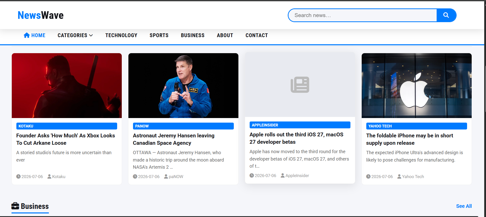

# 📰 NewsWave



## 📖 About

NewsWave is a dynamic news web application built with Django that delivers the latest news across multiple categories through a clean, responsive, and user-friendly interface.

## ✨ Features

- 🔍 Search for news articles
- 📰 Browse multiple news categories
- 📱 Responsive design
- 🎨 Clean and modern user interface
- ⚡ Dynamic content powered by Django

## 🛠️ Technologies Used

- Python
- Django
- HTML
- CSS
- Bootstrap
- JavaScript

## 🚀 Installation

1. Clone the repository
2. Install the required packages:
   ```bash
   pip install -r requirements.txt
   ```
3. Start the development server:
   ```bash
   python manage.py runserver
   ```

## 👩‍💻 Author

**Farzeen Fatima**
